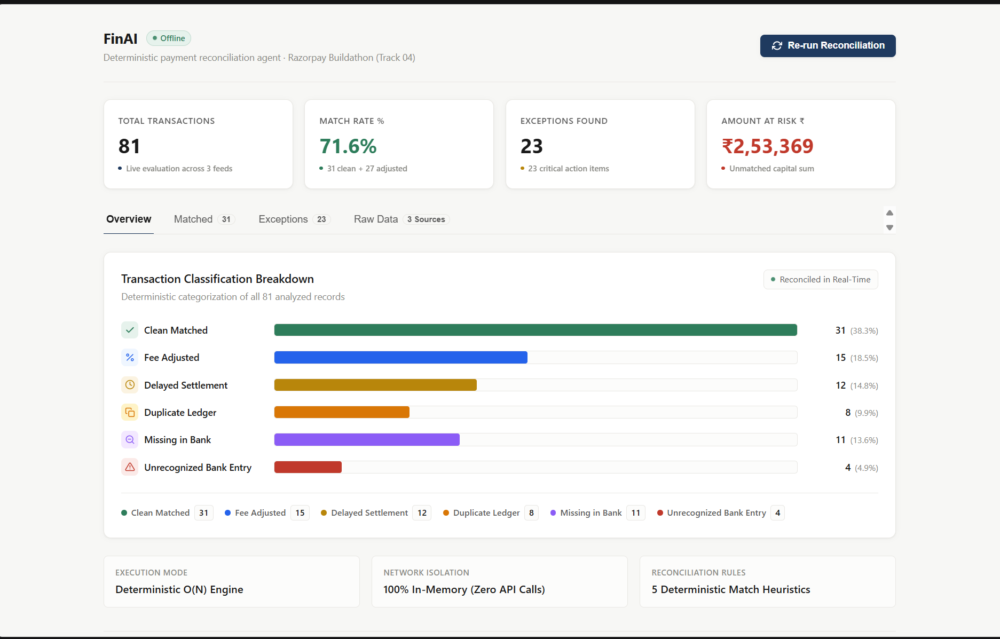

# FinAI — Offline Payment Reconciliation Agent

> **Why no AI model?** Because financial math should never be probabilistic. 
> FinAI uses AI-appropriate judgment — deciding *where* determinism matters — 
> rather than using AI *for* the math itself.

<!-- TODO: Replace screenshot.png with an actual screenshot of the Overview tab before submission -->


[](https://ykchoudhary110.github.io/Finai-Webapp/)
[-blue?style=for-the-badge)](https://github.com/ykchoudhary110/Finai-Webapp)
[](https://github.com/ykchoudhary110/Finai-Webapp)
[-purple?style=for-the-badge)](https://github.com/ykchoudhary110/Finai-Webapp)

> 🔗 **Live Demo URL:** [https://ykchoudhary110.github.io/Finai-Webapp/](https://ykchoudhary110.github.io/Finai-Webapp/)  
> 🏆 **Built For:** Razorpay Buildathon — Track 04 (AI Finance Controller)  
> 🔒 **Core Guarantee:** 100% deterministic, zero LLM hallucinations, zero internet dependency. Runs instantly via `file://` in any browser.

---

## 📌 Problem Statement (PS)

### The Challenge
In modern commerce, high-growth businesses and merchants process thousands of payments every day across multiple asynchronous systems:
1. **Payment Gateways (Razorpay)**: Record payment captures, gateway transaction fees, and batch settlement payouts.
2. **Core Banking Partners (HDFC, ICICI, SBI, Axis)**: Record lump-sum inward NEFT/IMPS/UPI credits, clearing days, and bank charges.
3. **Internal ERP & OMS Ledgers (Shopify, SAP, Custom SQL)**: Record customer orders, invoices, and gross billed amounts.

Traditionally, reconciling these three disparate data sources is a major bottleneck:
- **Manual Spreadsheets (Excel / VLOOKUP)**: Laborious, slow, and prone to costly human errors.
- **LLM Chatbot Wrappers**: Flawed for mission-critical accounting. LLMs hallucinate math calculations, introduce floating-point drift, add unpredictable 2–5 second API latency, and leak sensitive banking records / customer PII to external cloud servers.

### The Solution: FinAI
**FinAI** is a **pure client-side, deterministic financial reconciliation controller**. Built specifically for Track 04 (AI Finance Controller), it executes an $O(N)$ index-and-match algorithm directly in the browser. It ingests 3-way financial feeds, automatically distinguishes gateway fee deductions from bank float timing delays, detects ERP double-billings, isolates missing credits, flags anomalous orphan charges, and calculates total capital at risk — **all with zero API calls, zero latency, and zero telemetry**.

---

## ⚡ What is FinAI?

FinAI is **not** an AI chatbot wrapper. It is a **deterministic, auditable financial reconciliation engine** with an enterprise-grade dashboard UI.

```
                              [ Three-Way Financial Ingestion ]
                                              │
         ┌────────────────────────────────────┼────────────────────────────────────┐
         ▼                                    ▼                                    ▼
[ Razorpay Settlements ]            [ Internal ERP Ledger ]            [ Core Bank Statement ]
  • txn_id, amount, date              • order_id, txn_id, amount         • ref_id, narration,
  • status: settled                   • customer, date                     amount, date
         │                                    │                                    │
         └────────────────────────────────────┼────────────────────────────────────┘
                                              │
                                  [ O(N) Hash Index Build ]
                                              │
         ┌────────────────────────────────────┴────────────────────────────────────┐
         ▼                                                                         ▼
[ Auto-Reconciled Matches ]                                              [ Actionable Exceptions ]
 ├── 1. Clean Match (1:1 Exact)                                           ├── 4. Duplicate Ledger Billing
 ├── 2. Fee Adjusted (~2% Razorpay MDR)                                   ├── 5. Missing in Bank (Transit)
 └── 3. Delayed Settlement (1-2 Day Float)                                └── 6. Unrecognized Bank Charge
```

### Deterministic Matching Heuristics:
1. **Clean Match (1:1 Exact)**: Exact ledger amount equals bank statement credit within ₹0.50 and identical transaction dates.
2. **Fee Adjusted (~2% Razorpay MDR)**: Detects Razorpay's standard net payout formula: $\text{Net} = \text{round}(\text{Gross} \times 0.98 - 2)$. Automatically reconciles the fee difference without human intervention.
3. **Delayed Settlement (Float / Clearing Delay)**: Amount matches, but bank value date is 1–2 days after the order date due to banking clearing windows. Reconciles as an auto-resolved timing difference.
4. **Duplicate Ledger Entry (ERP Double-Billing)**: The same `txn_id` is recorded more than once in the internal ERP against only a single bank credit. Flags internal billing error.
5. **Missing in Bank (Unsettled Funds)**: Order captured in gateway and ledger, but zero bank credit received. Flags capital still in transit.
6. **Unrecognized Bank Charge (Anomalous / Fraud Flag)**: Bank credit with no corresponding order or settlement record. Flags orphan funds for compliance and fraud review.

---

## 📊 Data Source (Current Build)

This build generates realistic synthetic transaction data on-device (seeded, non-repeating) to demonstrate the reconciliation engine deterministically and reproducibly — without requiring real merchant financial data for a public demo. The reconciliation engine itself is fully generic, operating on standard txn_id / amount / date fields, and is designed to plug directly into real Razorpay settlement CSVs, bank exports, and ERP ledger data via a file upload layer as a next step.

---

## 🚀 Roadmap
- [ ] CSV/Excel upload for real Razorpay settlement, bank statement, and ERP exports
- [ ] Support for common Indian bank statement formats (HDFC, ICICI, SBI, Axis)
- [ ] Exportable reconciliation report (PDF/CSV) for accounting teams
- [ ] Configurable matching tolerances (fee %, date drift window) per merchant
- [ ] Multi-currency support for cross-border settlements

---

## 🖥️ How to Use the Dashboard

| Component | What It Does |
| :--- | :--- |
| **Header** | Displays the live `● Offline` pill badge and the **"Re-run Reconciliation"** action button. |
| **Metrics Row (4 Cards)** | Displays real-time synchronized count-up numbers: **Total Transactions**, **Match Rate %**, **Exceptions Found**, and **Amount at Risk ₹**. |
| **Overview Tab** | Renders a responsive **Horizontal Classification Bar Chart** showing proportional distribution across all 6 transaction categories, complete with animated fill transitions, percentage badges, and a comprehensive legend. |
| **Matched Tab** | Displays a sticky-header table of all clean, verified 1:1 records with Transaction ID, Order ID, Customer Name, Amount (₹), and Settlement Date. |
| **Exceptions Tab** | Interactive audit workspace with quick-filter chips (`All`, `Action Required`, `Fee Adjusted`, `Delayed`, `Duplicate`, `Missing`, `Unrecognized`). Each row includes a **3px colored left border** and a **plain-English business explanation**. |
| **Raw Data Tab** | Three expandable accordions (**Razorpay Settlements**, **Bank Statement**, **Internal Ledger**) allowing auditors and judges to inspect every raw record. |
| **"Re-run Reconciliation"** | Simulates a 450ms agent processing state with an animated rotating refresh icon, regenerates a seeded synthetic dataset, and executes the reconciliation engine live. |

---

## 💻 How to Install & Run on Your Personal System

FinAI has **zero external dependencies**, **zero npm packages**, and **no build step**. It runs out-of-the-box on **Windows, macOS, and Linux**.

### Method 1: Instant Launch (No Terminal or Node.js Required)
1. Download or clone this repository to your computer.
2. Locate **`index.html`** in your file manager (Windows Explorer, macOS Finder, or Linux Files).
3. **Double-click `index.html`** to open it directly in any modern browser (Chrome, Edge, Firefox, Safari, Brave).
4. That's it! It executes instantly via the `file://` protocol with **zero console errors**.

---

### Method 2: Clone via Git
Open your terminal (PowerShell, Command Prompt, or Bash) and run:
```bash
# 1. Clone the repository
git clone https://github.com/ykchoudhary110/Finai-Webapp.git

# 2. Navigate into the directory
cd Finai-Webapp

# 3. Open directly in your browser:
# On Windows:
start index.html

# On macOS:
open index.html

# On Linux:
xdg-open index.html
```

---

### Method 3: Run with a Local Static Server (Optional)
If you prefer running through `http://localhost`:

#### Using Python (Built-in on most systems):
```bash
# Python 3
python -m http.server 8000
```
Then visit: `http://localhost:8000`

#### Using Node.js:
```bash
npx serve .
```

#### Using VS Code:
Right-click `index.html` and click **"Open with Live Server"**.

---

## 🌐 How to Run Online (GitHub Pages)

1. Visit the live hosted site directly:  
   👉 **[https://ykchoudhary110.github.io/Finai-Webapp/](https://ykchoudhary110.github.io/Finai-Webapp/)**
2. If enabling Pages on a new fork:
   - Go to **Settings** ➔ **Pages**.
   - Under **Build and deployment** ➔ **Branch**, choose `main` and `/ (root)`.
   - Click **Save**.

---

## 📁 Repository Structure

```
Finai-Webapp/
├── index.html           # Core semantic markup; zero CDNs, hand-coded inline SVGs
├── style.css            # Design tokens, responsive grid, table shells & CSS animations
├── data-generator.js    # Seeded PRNG (Mulberry32) synthetic feed generator (zero DOM access)
├── reconciler.js        # Deterministic 3-way reconciliation engine (zero DOM access)
├── charts.js            # Responsive horizontal SVG/CSS classification bar chart renderer
├── app.js               # Application controller & DOM event wiring
└── finai/               # Standalone mirror copy of all project files
```

### Strict Separation of Concerns:
- **`data-generator.js`**: Pure functions. Produces 60–80 multi-source transactions with whole-rupee amounts (₹199–₹24,999), Indian customer names, and injected anomalies. Does not pre-label categories.
- **`reconciler.js`**: Pure functions. Accepts raw data, indexes by transaction key, executes classification heuristics, sums amount at risk, and generates human-readable audit reasons.
- **`charts.js`**: Pure rendering functions. Takes a container and category counts, injecting horizontal proportional bars with staggered entrance delays.
- **`app.js`**: The **only** file allowed to access the DOM or attach event listeners. Manages RAF count-up animations, tab switching, and accordion toggles.

---

## 🔍 Verification & Audit Checklist for Judges

1. **Verify Complete Offline Isolation (No Network Calls)**:
   - Open Developer Tools (`F12` or `Ctrl + Shift + I`) ➔ Select the **Network** tab.
   - Click **"Re-run Reconciliation"**.
   - **Result:** **0 HTTP requests**. Zero external fonts, zero CDN libraries, zero API telemetry.
2. **Verify Determinism & Edge Cases**:
   - Click **"Re-run Reconciliation"** 5+ times in rapid succession.
   - **Result:** Numbers always fall within realistic accounting ranges (Match Rate ~70–75%, Exceptions never 0, Amount at Risk accurately summed).
3. **Inspect Plain-English Audit Rationale**:
   - Navigate to the **"Exceptions"** tab and filter by **"Fee Adjusted"**, **"Delayed"**, **"Duplicate"**, **"Missing"**, and **"Unrecognized"**.
   - **Result:** Every row displays a specific plain-English reason corresponding to its underlying data.
4. **Audit Raw Data**:
   - Navigate to the **"Raw Data"** tab and inspect records across Razorpay Settlements, Bank Statement, and Internal Ledger.

---

## 📄 License
MIT License. Built for the **Razorpay Buildathon — Track 04 (AI Finance Controller)**.
